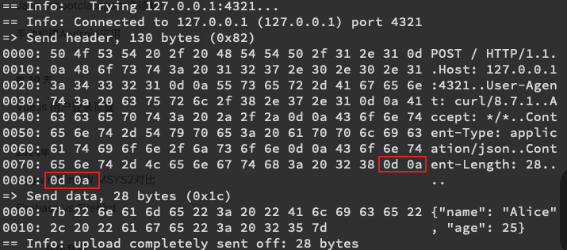

# 2. Reading a Request

|本期版本|上期版本|
|:---:|:---:|
`Wed Mar 12 00:52:31 CST 2025` | `Fri Jul  7 11:53:06 CST 2023`

## TCP is Not Our Friend Here

[从零实现一个http服务器](https://mp.weixin.qq.com/s?__biz=Mzk0MjUwNDE2OA==&mid=2247496485&idx=1&sn=ce91fce705cd386b4d743754affd4bcb&source=41#wechat_redirect)

> 也就是说http协议由两部分组成：包头和包体，包头与包体之间使用一个\r\n分割，由于http协议包头的每一行都是以**\r\n**结束，所以http协议包头一般以**\r\n\r\n**结束。

[http 协议的结束符 · Issue #34 · jinhailang/blog](https://github.com/jinhailang/blog/issues/34)

> http 的 `header` 和 `body` 之间空行分割的，又因为每个头部项是以 `\r\n` 作为结束符，所以，数据流中是以 `\r\n\r\n` 来分割解析请求头(响应头)与请求体（响应体）的。如下图所示：


```bash
curl --trace  -X POST http://127.0.0.1:4321 \
     -H "Content-Type: application/json" \
     -d '{"name": "Alice", "age": 25}'
```


```
== Info:   Trying 127.0.0.1:4321...
== Info: Connected to 127.0.0.1 (127.0.0.1) port 4321
=> Send header, 130 bytes (0x82)
0000: 50 4f 53 54 20 2f 20 48 54 54 50 2f 31 2e 31 0d POST / HTTP/1.1.
0010: 0a 48 6f 73 74 3a 20 31 32 37 2e 30 2e 30 2e 31 .Host: 127.0.0.1
0020: 3a 34 33 32 31 0d 0a 55 73 65 72 2d 41 67 65 6e :4321..User-Agen
0030: 74 3a 20 63 75 72 6c 2f 38 2e 37 2e 31 0d 0a 41 t: curl/8.7.1..A
0040: 63 63 65 70 74 3a 20 2a 2f 2a 0d 0a 43 6f 6e 74 ccept: */*..Cont
0050: 65 6e 74 2d 54 79 70 65 3a 20 61 70 70 6c 69 63 ent-Type: applic
0060: 61 74 69 6f 6e 2f 6a 73 6f 6e 0d 0a 43 6f 6e 74 ation/json..Cont
0070: 65 6e 74 2d 4c 65 6e 67 74 68 3a 20 32 38 0d 0a ent-Length: 28..
0080: 0d 0a                                           ..
=> Send data, 28 bytes (0x1c)
0000: 7b 22 6e 61 6d 65 22 3a 20 22 41 6c 69 63 65 22 {"name": "Alice"
0010: 2c 20 22 61 67 65 22 3a 20 32 35 7d             , "age": 25}
== Info: upload completely sent off: 28 bytes
```





```
"POST / HTTP/1.1\r\n"
"Host: 127.0.0.1:4321\r\n"
"User-Agent: curl/8.7.1\r\n"
"Accept: */*\r\n"
"Content-Type: application/json\r\n"
"Content-Length: 28\r\n"
"\r\n"
```


* uses a separator: two newlines in a row
* 一行中有两个换行，代表请求结束


```ruby
# chomp vs strip
# # 用 `\n`、替换 `\r\n` 应该是后续方便在系统终端显示
out << line.chomp "\n"
return(out) if line.strip == ""
```

## Request Parsing

## Exercises

**Exercise One: Parameters**

```bash
# GET /?search=delicious HTTP/1.1
curl "http://localhost:4321/?search=delicious"
```

**Exercise Two: More Parameters**

* `-d` it will send a POST request, . But you can tell it not to with `--get`

```bash
# GET /my/url?page=7&search=delicious HTTP/1.1
curl --get -d search=delicious "http://localhost:4321/my/url?page=7"
```

**Exercise Three: Basic Authentication**

```bash
# Authorization: Basic Ym9ibzpib2JvcHdk
curl -u bobo:bobopwd --basic http://localhost:4321
```

## References

> The WWW Common Gateway Interface Version 1.1

* <https://github.com/ruby/webrick/blob/master/lib/webrick/httprequest.rb#L403C19-L403C43>

* `Webrick`、`Puma`、`Mongrel`

## Ref

* <https://github.com/noahgibbs/rebuilding_http>
* [`String#strip`](https://www.rubydoc.info/stdlib/core/String:strip)
* [`String#chomp`](https://www.rubydoc.info/stdlib/core/String:chomp)